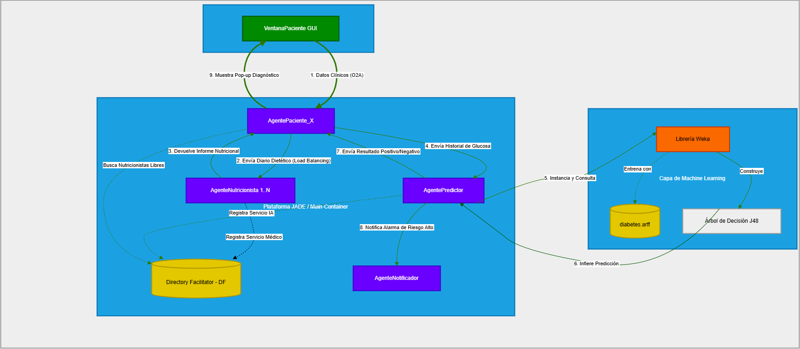

# DiaPredict - Sistema Multiagente Inteligente para la Gestión y Predicción de Diabetes


## 1. Introducción y Datos del Grupo

En la carpeta raíz del archivo comprimido (`.zip`) entregado, se ha adjuntado un documento independiente llamado `Autores.txt`. En dicho archivo se detallan los nombres completos, correos electrónicos institucionales y DNIs de todos los miembros que componen este grupo de prácticas. Además del puntero a este proyecto de Git.

A continuación, en este archivo `README.md`, se presenta la documentación técnica, las guías de uso y los detalles de la arquitectura del sistema alojado en este repositorio de GitHub.

---

## 2. Estructura y Gestión del Repositorio

Para el desarrollo de la práctica, optamos por seguir una metodología de trabajo organizada mediante ramas en Git. El objetivo principal fue dividir el proyecto según los roles de cada integrante para avanzar de forma paralela, evitar conflictos de código y poder probar las funcionalidades de manera aislada antes de integrarlas.

El repositorio se dividió originalmente en 5 ramas:

* **`master`**: La rama principal. Al inicio contenía la estructura limpia del proyecto y la base de la plataforma JADE proporcionada por el equipo. Al final, se convirtió en la rama de producción donde reside el código definitivo y pulido.

* **`rama-agentes`**: Dedicada a la creación e implementación de los cuatro agentes del sistema (AgentePaciente, AgenteNutricionista, AgentePredictor y AgenteNotificador). Aquí se desarrolló toda la estructura JADE: comunicación mediante mensajes FIPA-ACL, comportamientos cíclicos, registro y búsqueda en el Directory Facilitator (DF) y el balanceo de carga aleatorio.

* **`rama-gui`**: Enfocada exclusivamente en la Interfaz Gráfica de Usuario (Java Swing). Incluye el diseño de la VentanaPaciente, la captura de las variables biomédicas y la conexión de la ventana con el agente subyacente mediante el paso de objetos (comunicación O2A).

* **`rama-ia`**: Centrada única y exclusivamente en la integración de la librería Weka en Java. En esta rama se trabajó el preprocesamiento del dataset, el entrenamiento y la evaluación del modelo de Machine Learning (arbol de decisión J48), que posteriormente se inyectó en la lógica del AgentePredictor.

* **`rama-utils`**: Destinada a las herramientas de configuración y arranque del sistema. Incluye el desarrollo del Launcher.java, la instanciación del Runtime de JADE y la creación del contenedor principal (Main-Container).

### Flujo de Integración
Una vez que cada integrante programó su parte y comprobamos de manera aislada que la lógica de cada agente funcionaba correctamente, realizamos el merge hacia la rama master. Con todas las piezas unidas en la rama principal, realizamos las pruebas de integración multiagente, solucionamos las condiciones de carrera y pulimos los últimos detalles del sistema distribuido que se presenta hoy.

---

## 3. Instrucciones de Instalación y Configuración

Siga estrictamente estos pasos para importar, configurar y dejar el proyecto listo para su compilación en Eclipse sin errores.

### Paso 3.1: Clonar el repositorio en Eclipse
1. Abra Eclipse IDE.
2. En el menú superior, diríjase a **File > Import...**
3. En la ventana emergente, expanda la carpeta **Git**, seleccione **Projects from Git (with smart import)** y haga clic 	en 	**Next**.
4. Seleccione **Clone URI** y haga clic en **Next**.
5. En la casilla **URI**, pegue exactamente la siguiente dirección URL del repositorio: `https://github.com/pcalle23/DiaPredict.git` *(Los campos de Host y Repository path se rellenarán automáticamente)*. Haga clic en **Next**.
6. Seleccione la rama `master` (o asegúrese de que esté marcada), ademas de las demás y haga clic en Next.
7. Elija el *directorio local de su ordenador* donde se guardará el proyecto y haga clic en **Next**.
8. En la última ventana, asegúrese de que la *casilla del proyecto está marcada* y haga clic en **Finish**. Eclipse descargará el código y creará el proyecto en su Workspace.

### Paso 3.2: Verificación de Dependencias y Configuración del Build Path.
El proyecto incluye las librerías necesarias (`.jar`) directamente en su carpeta raíz. Es obligatorio *verificar que Eclipse las ha indexado correctamente en el Classpath* para evitar errores de compilación (subrayados rojos en el código).
1. En el **Package Explorer** (panel izquierdo), haga clic derecho sobre la carpeta raíz del proyecto `DiaPredict` y seleccione *Properties*.
2. En el menú izquierdo de la ventana de *propiedades*, haga clic en **Java Build Path**.
3. Seleccione la pestaña **Libraries** en la parte superior.
4. Asegúrese de desplegar la sección llamada **Classpath**.
5. Compruebe si dentro de *Classpath* ya aparecen listados los siguientes dos archivos: `jade.jar` y 	`weka.jar`
6. **Si NO aparecen añadidos automáticamente:**
* Haga clic en el botón **Add JARs...** situado a la derecha.
* Navegue dentro de las carpetas de su propio proyecto `DiaPredict` hasta la raíz.
* Seleccione los archivos `jade.jar` y `weka.jar`.
* Haga clic en **OK**.
* Haga clic en el botón **Apply and Close**. Los subrayados rojos de error en las clases de los agentes deberían 	desaparecer por completo.

### Paso 3.3: Verificación del Dataset de Inteligencia Artificial (diabetes.arff)

Para que el `AgentePredictor` pueda entrenar el modelo de Machine Learning localmente, necesita acceder al archivo de datos históricos.

* En el **Package Explorer** de Eclipse, asegúrese de que el archivo `diabetes.arff` se encuentra físicamente en la raíz del proyecto.

> *¿Por qué es obligatorio?* El `AgentePredictor` carga este archivo utilizando una ruta relativa en Java. Si el archivo 	se mueve dentro de `src` o se borra de la raíz, la librería Weka lanzará una excepción de archivo no encontrado (`FileNotFoundException`) y la Inteligencia Artificial no podrá emitir diagnósticos.

---

## 4. Instrucciones de Ejecución
Para arrancar la plataforma JADE y los agentes del sistema clínico sin que Java bloquee la ejecución por restricciones de seguridad interna, siga estos pasos:
### Paso 4.1: Configuración de los Argumentos de Ejecución (Evitar Excepciones de Java)
Debido a las restricciones de encapsulamiento en las versiones modernas de Java (a partir de Java 9/11+), JADE 	necesita permisos explícitos para acceder a ciertas estructuras internas del sistema. Si no se configuran, el programa lanzará una excepción inmediatamente al arrancar.

1. En el **Package Explorer**, navegue por los paquetes: `src` > `paquete.utils`.
2. Haga clic derecho sobre el archivo `Launcher.java` y seleccione **Run As > Run Configurations...**
3. En el panel izquierdo, asegúrese de que está seleccionada la configuración de **Java Application** correspondiente a `Launcher`.
4. En el panel derecho, haga clic en la pestaña **Arguments**.
5. Busque el cuadro de texto inferior llamado **VM arguments:** 
6. Pegue exactamente la siguiente variable de apertura en ese cuadro de texto: 
```bash
   --add-opens java.base/java.lang=ALL-UNNAMED
```
7. Haga clic en el botón **Apply** para guardar los cambios de forma permanente.

### Paso 4.2: Lanzar el Sistema Base
Con la configuración guardada, haga clic en el botón **Run** de esa misma ventana (o en el futuro, haga clic derecho en `Launcher.java` > **Run As** > **Java Application**).

**Resultado esperado inmediato:**
Se abrirá la *consola de Eclipse* mostrando la inicialización del contenedor de JADE.
Se lanzará la *interfaz gráfica* oficial de monitorización de `JADE`, donde podrá ver el árbol con el **Main-Container**.
Se abrirá automáticamente en su pantalla la primera **interfaz gráfica** del paciente de manera autónoma, bajo el título `DiaPredict - AgentePaciente_1`.

### Paso 4.3: Escalabilidad en Vivo
Para poner a prueba la arquitectura multiagente distribuida y el balanceo de carga con múltiples agentes concurrentes, realice los siguientes pasos directamente desde la GUI de JADE:
1. En la ventana del árbol de JADE, despliegue el nodo principal hasta localizar la carpeta **Main-Container**.
2. Haga clic derecho sobre **Main-Container** y seleccione la opción **Start New Agent**.
3. Para crear un nuevo Nutricionista:
* En **Agent Name**, escriba: `AgenteNutricionista_2` *(o el número correspondiente)*.
* En **Class Name**, escriba exactamente: `paquete.agentes.AgenteNutricionista`.
* Haga clic en **OK**.

4.Para crear un nuevo Paciente:
* Haga clic derecho de nuevo en **Main-Container** > **Start New Agent**.
* En Agent Name, escriba: `AgentePaciente_2` *(o el número correspondiente)*.
* En Class Name, escriba exactamente: `paquete.agentes.AgentePaciente`.
* Haga clic en **OK**. Se generará una nueva ventana independiente en su pantalla asociada a este nuevo paciente.

---

## 5. Datos de ejemplo para ejecutar la práctica

Para evaluar la robustez del sistema multiagente y la precisión del modelo Weka, se han diseñado varios perfiles de prueba. Estos perfiles ponen a prueba al sistema basándose en las directrices médicas oficiales de la **ADA (American Diabetes Association)**:
* **Glucosa Basal (Ayunas)**: Normal (< 100 mg/dL), Prediabetes (100 - 125 mg/dL), Diabetes (≥ 126 mg/dL).
* **Glucosa Postprandial (2h tras comer)**: Normal (< 140 mg/dL), Prediabetes o Intolerancia (140 - 199 mg/dL), Diabetes (≥ 200 mg/dL).
Recomendamos introducir los siguientes perfiles en la ventana del `AgentePaciente` para observar las distintas respuestas del sistema:

### Caso 1: Paciente Sano con Variabilidad Normal
Este caso demuestra que el modelo no sufre de sobreajuste y entiende que las glucemias pueden oscilar de forma natural si los umbrales críticos se mantienen bajo control.

| Variable/Momento día | Edad/Glucosa Ayunas | Mañana | Tarde | Noche |
|---|---|---|---|---|
| Edad/Glucosa Ayunas | Edad:23/Glucosa Ayunas: 90 | - | - | - |
| Carbohidratos | - | 40g | 65g | 35g |
| Glucosa pre-comida | - | 90 | 98 | 95 |
| Glucosa post-comida | - | 115 | 122 | 112 |

* Veredicto Esperado: **RIESGO BAJO (Negativo)**

### Caso 2: Prediabetes Basal Asintomática (El peligro silencioso)
Las glucosas después de comer son perfectas, pero el paciente presenta una alteración en ayunas (108 mg/dL). El sistema demuestra sensibilidad clínica al capturar este riesgo temprano (rango 100-125 de la ADA), activando al notificador.

| Variable/Momento día | Edad/Glucosa Ayunas | Mañana | Tarde | Noche |
|---|---|---|---|---|
| Edad/Glucosa Ayunas | Edad:45/Glucosa Ayunas: 108 | - | - | - |
| Carbohidratos | - | 35g | 50g | 30g |
| Glucosa pre-comida | - | 108 | 90 | 92 |
| Glucosa post-comida | - | 125 | 130 | 120 |

* Veredicto Esperado: **RIESGO ALTO (Prediabetes)**

### Caso 3: Diabetes Tipo Establecida
Caso de diagnóstico claro. Cumple simultáneamente los dos criterios de corte crítico de la ADA: glucosa basal > 126 mg/dL y picos postprandiales > 200 mg/dL.

| Variable/Momento día | Edad/Glucosa Ayunas | Mañana | Tarde | Noche |
|---|---|---|---|---|
| Edad/Glucosa Ayunas | Edad:62/Glucosa Ayunas: 135 | - | - | - |
| Carbohidratos | - | 45g | 70g | 40g |
| Glucosa pre-comida | - | 135 | 120 | 125 |
| Glucosa post-comida | - | 210 | 235 | 205 |

* Veredicto Esperado: **RIESGO ALTO (Positivo Clínico)**

### Caso 4: La Paradoja Postprandial 
El paciente se levanta con una glucosa excelente (88 mg/dL), lo que confundiría a un sistema simple. Sin embargo, dispara picos de hasta 185 mg/dL por la tarde (Intolerancia a la glucosa). Este caso justifica la decisión arquitectónica de capturar 11 variables diarias en la interfaz, permitiendo a la IA detectar lo que una simple prueba en ayunas pasaría por alto.

| Variable/Momento día | Edad/Glucosa Ayunas | Mañana | Tarde | Noche |
|---|---|---|---|---|
| Edad/Glucosa Ayunas | Edad:38/Glucosa Ayunas: 88 | - | - | - |
| Carbohidratos | - | 50g | 80g | 40g |
| Glucosa pre-comida | - | 88 | 95 | 98 |
| Glucosa post-comida | - | 165 | 185 | 155 |

* Veredicto Esperado: **RIESGO ALTO (Intolerancia a la Glucosa)**

### Caso 5:  El Caso Límite Extremo 
Este es el test de estrés definitivo para el algoritmo. El paciente está al límite absoluto de la normalidad médica según la ADA: su glucosa en ayunas es 99 mg/dL (el límite es <100) y sus picos post-comida alcanzan los 139 mg/dL (el límite es <140). El sistema demuestra una precisión matemática exacta al clasificarlo como sano, probando que las fronteras de decisión del árbol J48 quedaron perfectamente calibradas y no generan falsos positivos por un solo miligramo de diferencia.

| Variable/Momento día | Edad/Glucosa Ayunas | Mañana | Tarde | Noche |
|---|---|---|---|---|
| Edad/Glucosa Ayunas | Edad:31/Glucosa Ayunas: 99 | - | - | - |
| Carbohidratos | - | 45g | 60g | 30g |
| Glucosa pre-comida | - | 99 | 95 | 92 |
| Glucosa post-comida | - | 139 | 138 | 139 |

* Veredicto Esperado: **RIESGO BAJO (Negativo)**

---

## 6. Diagrama de la arquitectura del sistema



---

## 7. Declaración de IA 

De acuerdo con las directrices académicas actuales, declaramos de forma transparente que se han utilizado LLMs como herramientas de asistencia durante el desarrollo de esta práctica.

Para garantizar la autoría del proyecto, el uso de la IA se limitó estrictamente a tareas de soporte, consultoría y co-pilotaje, asegurando que toda la arquitectura multiagente, el diseño del sistema y la lógica de negocio han sido ideados y programados por los miembros del grupo.

El uso específico de la IA generativa se desglosa en los siguientes puntos:

* Refinamiento y Optimización de Código 
* Resolución de Excepciones del Entorno
* Aumento y Duplicación del Dataset
* Diseño de Escenarios de Prueba Clínicos
* Revisión y adaptación de README y Presentación

### Última actualización README

22 de mayo de 2026

